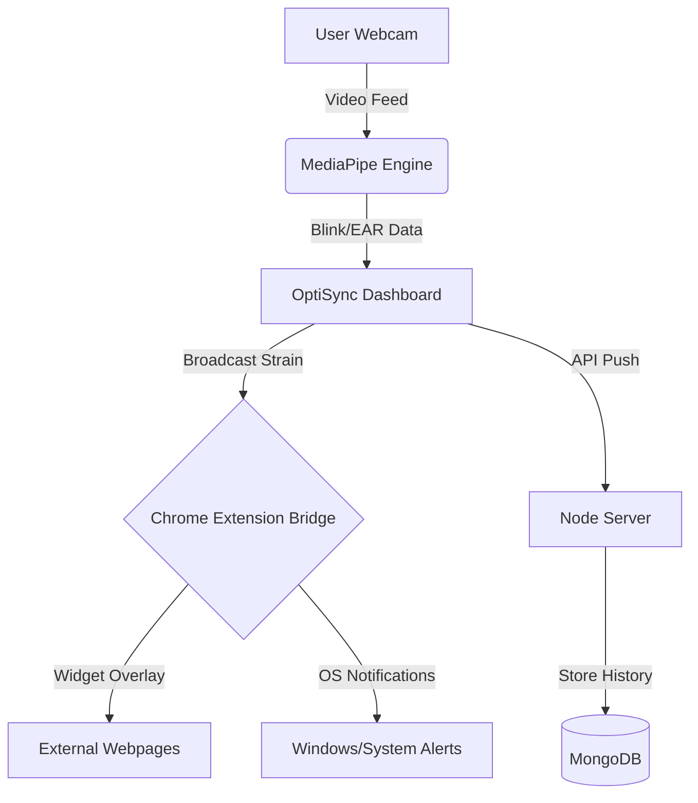

# <p align="center">👁️ OptiSync — Cognitive OS</p>

<p align="center">
  
</p>

<p align="center">
  <strong>Real-time ocular wellness and burnout prevention powered by AI.</strong><br>
  <em>Mitigating Digital Eye Strain through precision biometric tracking and active intervention.</em>
</p>

<p align="center">
  
  
  
  
</p>

---

## 🚀 Overview

**OptiSync** is a high-performance "Cognitive Operating System" designed to solve the growing problem of Digital Eye Strain (DES). By leveraging **MediaPipe Face Mesh**, OptiSync monitors your biological markers in real-time to calculate a predictive "Strain Score," triggering active therapy sessions before burnout occurs.

### 🌟 Key Pillars
*   **Biometric Precision:** Real-time tracking of Eye Aspect Ratio (EAR) and Blink Rate.
*   **Active Intervention:** Mandatory therapy modules that trigger at high fatigue levels.
*   **Global Integration:** A Chrome Extension bridge that keeps your eyes safe across the entire web.
*   **Historical Insights:** Long-term data tracking to understand your ocular health over time.

---

## 🛠️ Technology Stack

| Component | Technology | Role |
| :--- | :--- | :--- |
| **Frontend** | React 18 + Vite | Premium Dashboard & Therapy Modules |
| **Detection Engine** | MediaPipe Face Mesh | AI-driven facial landmark & eye tracking |
| **Extension** | Manifest V3 (JS) | Global UI overlay and cross-tab communication |
| **Backend** | Node.js + Express | Data persistence and analytics API |
| **Database** | MongoDB | Hourly strain history and telemetry |
| **Styling** | Vanilla CSS3 | Glassmorphism & High-fidelity UI |

---

## 🏗️ System Architecture



---

## ✨ Core Features

### 👁️ Biometric Monitoring
*   **EAR Scoring:** Advanced heuristics to differentiate between focus and fatigue.
*   **Staring Penalty:** Automated strain increase when blink rate drops below 15 BPM.
*   **Posture Sensing:** Proximity alerts if you slouch or sit too close to the screen.

### 🚨 Progressive Intervention
1.  **Mild (40%):** Subtle in-app toast and OS notification.
2.  **Warning (60%):** Widget turns amber; suggested "Look Away" timer.
3.  **Critical (80%+):** Mandatory Therapy Sequence. The Dashboard hijacks focus until a reset module is completed.

### 🧘 Therapy Library
*   **Infinity Tracker:** Following a smooth orbital path to exercise eye muscles.
*   **Palming Audio:** Guided sensory deprivation with physiological rest cues.
*   **20-20-20 Protocol:** Real-time monitored break (20ft, 20s).
*   **Acupressure Guide:** Guided massage session for ocular tension release.

---

## 🚦 Getting Started

### 1. Requirements
*   Node.js (v18+)
*   MongoDB (Running locally on :27017)
*   Chrome Browser (for Extension support)

### 2. Backend Setup
```bash
cd backend
npm install
node server.js
```

### 3. Frontend Setup
```bash
cd web-app
npm install
npm run dev
```

### 4. Extension Installation
1.  Open Chrome and navigate to `chrome://extensions/`.
2.  Enable **Developer Mode** (top right).
3.  Click **Load Unpacked**.
4.  Select the root `OpticSync` directory.

---

## 🗺️ Roadmap
- [ ] **Gaze Heatmaps:** Detect "Tunnel Vision" by tracking eye focus areas.
- [ ] **Community Challenges:** Sync wellness streaks with friends.
- [ ] **Mobile Support:** React RN bridge for mobile monitoring.
- [ ] **Dynamic Lighting:** Auto-adjust screen brightness based on eye strain score.

---

<p align="center">
  Created for the future of digital wellness. 🌿<br>
  <strong>OptiSync — Stay Sharp. Stay Synced.</strong>
</p>
