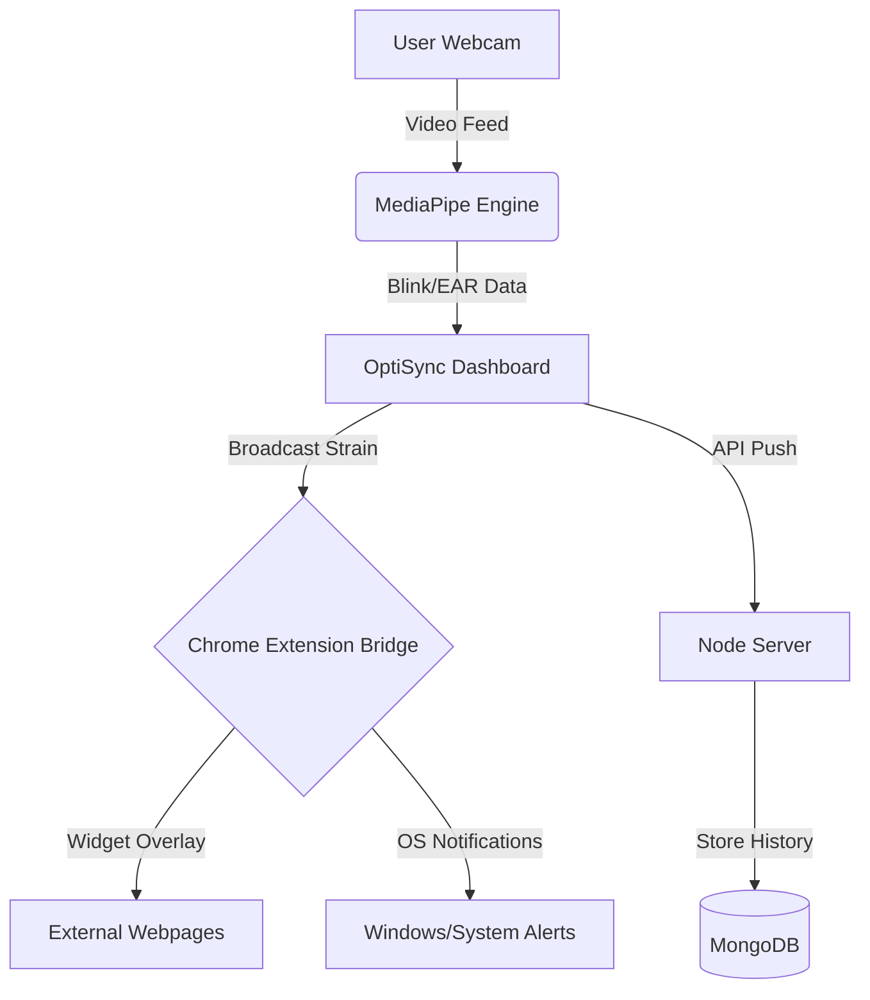

<<<<<<< HEAD
# <p align="center">👁️ OptiSync — Cognitive OS</p>

<p align="center">
  
</p>

<p align="center">
  <strong>Real-time ocular wellness and burnout prevention powered by AI.</strong><br>
  <em>Mitigating Digital Eye Strain through precision biometric tracking and active intervention.</em>
</p>

<p align="center">
  
  
  
  
</p>

---

## 🚀 Overview

**OptiSync** is a high-performance "Cognitive Operating System" designed to solve the growing problem of Digital Eye Strain (DES). By leveraging **MediaPipe Face Mesh**, OptiSync monitors your biological markers in real-time to calculate a predictive "Strain Score," triggering active therapy sessions before burnout occurs.

### 🌟 Key Pillars
*   **Biometric Precision:** Real-time tracking of Eye Aspect Ratio (EAR) and Blink Rate.
*   **Active Intervention:** Mandatory therapy modules that trigger at high fatigue levels.
*   **Global Integration:** A Chrome Extension bridge that keeps your eyes safe across the entire web.
*   **Historical Insights:** Long-term data tracking to understand your ocular health over time.
=======
# OptiSync OS - Cognitive Health & Proximity Monitoring System


OptiSync OS is a cutting-edge **Cognitive Operating System** designed to monitor eye strain, posture, and burnout in real-time. By leveraging computer vision (MediaPipe) and AI, it helps digital professionals and students maintain ocular health through proactive alerts and interactive therapy modules.

---

## 🚀 Key Features

### 👁️ Real-time Eye Strain Monitoring
- **Live EAR Calculation**: Calculates Eye Aspect Ratio at 15-30fps to detect fatigue.
- **Blink Rate Analytics**: Tracks Blinks Per Minute (BPM) to identify "staring syndrome" and provide restorative feedback.
- **Predictive Burnout Model**: A proprietary algorithm that maps eye behavior and blink patterns to a live 0-100% strain level.

### 📏 Proximity Hazard Alerts
- **Distance Tracking**: Monitors precise distance between eyes and screen using facial geometry.
- **Posture Calibration**: Calibrate your "Ideal Posture" and receive alerts if you develop a "hunch" for more than 90 seconds.
- **Visual Feedback**: Real-time status indicators (Safe, Warning, Hazard) on the dashboard.

### 🧘 Interactive Therapy Modules
Integrated "Cognitive Reset" sequences to drop strain levels immediately:
- **Focus Shifter**: Dynamic visual exercise for depth perception.
- **Infinity Tracker**: Orbital tracking for ocular muscle relaxation.
- **Corner Taps**: Peripheral vision engagement.
- **Palming Audio**: Guided sensory deprivation protocol.
- **20-20-20 Rule**: Automated monitoring of 20-foot look-aways for 20 seconds.

### 🔗 Complete Ecosystem
- **Chrome Extension Sync**: Broadcasts strain state to a persistent widget on every browser tab.
- **OS Notifications**: Native desktop alerts for high fatigue and proximity hazards (even when tab is idle).
- **History Analytics**: Persistent backend tracking with hourly strain aggregation and daily health reports.
>>>>>>> 015a9235cac95423d01e584f3e33d72974e41a53

---

## 🛠️ Technology Stack

<<<<<<< HEAD
| Component | Technology | Role |
| :--- | :--- | :--- |
| **Frontend** | React 18 + Vite | Premium Dashboard & Therapy Modules |
| **Detection Engine** | MediaPipe Face Mesh | AI-driven facial landmark & eye tracking |
| **Extension** | Manifest V3 (JS) | Global UI overlay and cross-tab communication |
| **Backend** | Node.js + Express | Data persistence and analytics API |
| **Database** | MongoDB | Hourly strain history and telemetry |
| **Styling** | Vanilla CSS3 | Glassmorphism & High-fidelity UI |

---

## 🏗️ System Architecture



---

## ✨ Core Features

### 👁️ Biometric Monitoring
*   **EAR Scoring:** Advanced heuristics to differentiate between focus and fatigue.
*   **Staring Penalty:** Automated strain increase when blink rate drops below 15 BPM.
*   **Posture Sensing:** Proximity alerts if you slouch or sit too close to the screen.

### 🚨 Progressive Intervention
1.  **Mild (40%):** Subtle in-app toast and OS notification.
2.  **Warning (60%):** Widget turns amber; suggested "Look Away" timer.
3.  **Critical (80%+):** Mandatory Therapy Sequence. The Dashboard hijacks focus until a reset module is completed.

### 🧘 Therapy Library
*   **Infinity Tracker:** Following a smooth orbital path to exercise eye muscles.
*   **Palming Audio:** Guided sensory deprivation with physiological rest cues.
*   **20-20-20 Protocol:** Real-time monitored break (20ft, 20s).
*   **Acupressure Guide:** Guided massage session for ocular tension release.

---

## 🚦 Getting Started

### 1. Requirements
*   Node.js (v18+)
*   MongoDB (Running locally on :27017)
*   Chrome Browser (for Extension support)

### 2. Backend Setup
=======
- **Frontend**: React 19, Vite, Chart.js, MediaPipe (Face Mesh).
- **Backend**: Node.js, Express, MongoDB (Mongoose) for history persistence.
- **Extension**: Chrome Extension Manifest v3, Service Workers, Content API.
- **AI**: Computer vision models running locally on client side for privacy.

---

## 📦 Installation & Setup

### 1. Prerequisites
- **Node.js**: v18 or higher.
- **MongoDB**: Local installation running on `mongodb://localhost:27017`.
- **Hardware**: Standard webcam.

### 2. Setup Procedure

**Backend Server**
>>>>>>> 015a9235cac95423d01e584f3e33d72974e41a53
```bash
cd backend
npm install
node server.js
```

<<<<<<< HEAD
### 3. Frontend Setup
=======
**React Dashboard**
>>>>>>> 015a9235cac95423d01e584f3e33d72974e41a53
```bash
cd web-app
npm install
npm run dev
```

<<<<<<< HEAD
### 4. Extension Installation
1.  Open Chrome and navigate to `chrome://extensions/`.
2.  Enable **Developer Mode** (top right).
3.  Click **Load Unpacked**.
4.  Select the root `OpticSync` directory.

---

## 🗺️ Roadmap
- [ ] **Gaze Heatmaps:** Detect "Tunnel Vision" by tracking eye focus areas.
- [ ] **Community Challenges:** Sync wellness streaks with friends.
- [ ] **Mobile Support:** React RN bridge for mobile monitoring.
- [ ] **Dynamic Lighting:** Auto-adjust screen brightness based on eye strain score.

---

<p align="center">
  Created for the future of digital wellness. 🌿<br>
  <strong>OptiSync — Stay Sharp. Stay Synced.</strong>
</p>
=======
**Chrome Extension**
1. Navigate to `chrome://extensions/` in your browser.
2. Enable **Developer Mode** (top right).
3. Click **Load Unpacked**.
4. Select the root project folder (`/electrothon`).

---

## 🎯 Getting Started

1. **Launch the Stack**: Ensure both the backend and web-app are running.
2. **Access Dashboard**: Open `http://localhost:5173` (or your local Vite port).
3. **Calibrate Posture**: Sit in your natural working position and click "Calibrate" in the webcam frame.
4. **Link Extension**: Click the green "Link Chrome Extension" button to enable system-level alerts.
5. **Session Monitoring**: Work as usual. OptiSync will automatically trigger therapy modules if strain thresholds (40% mild, 80% severe) are exceeded.

---

## 🏆 Project Context
Developed for **Electrothon**, OptiSync OS aims to bridge the gap between high-performance digital work and human biological limits.

---

## 📜 License
ISC License.

---

*Stay Focused. Stay Healthy. OptiSync.*
>>>>>>> 015a9235cac95423d01e584f3e33d72974e41a53
